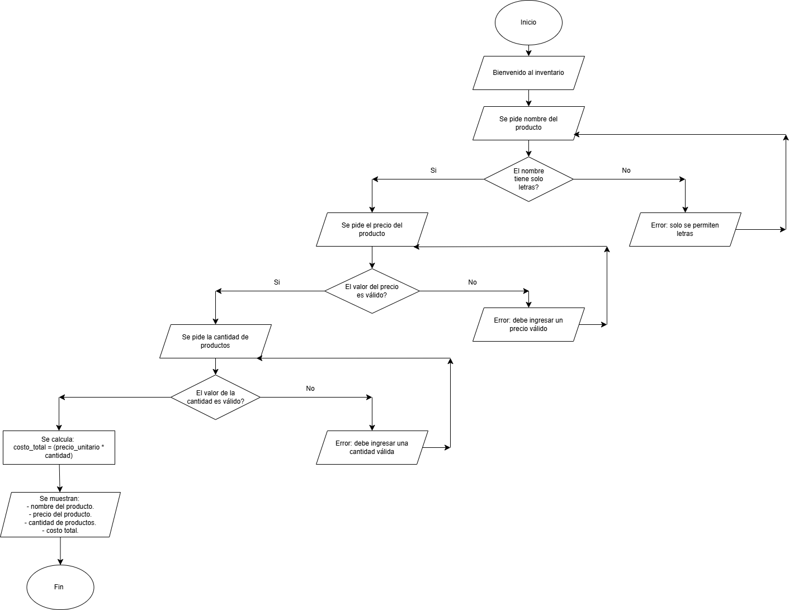

# Programa De Inventario

## Descripción
Este proyecto es un programa simple de inventario desarrollado en Python.
El programa funciona en la consola y permite al usuario registrar un producto y calcular el costo total de la compra.

El programa solicita al usuario el nombre del producto, el precio unitario y la cantidad.  
El sistema valida la información ingresada antes de continuar.  
El programa calcula el costo total multiplicando el precio unitario por la cantidad.  
Finalmente, el sistema muestra la información como una pequeña factura en la pantalla.

## Explicación del proyecto paso a paso
## Requisitos

- Python 3


 ### Instalación de Python
 ---
Antes de ejecutar el programa, necesitamos instalar Python, que es el lenguaje de programación con el que está hecho el proyecto.

---
##### Qué es Python? 
Python es un programa que permite escribir y ejecutar código en la computadora.

---
##### Como lo instalo?

Instala Python siguiendo estos pasos:

---
1. Ir a la página oficial de Python.
   
-  ```[Python - Página oficial](https://www.python.org)```

2. Hacer clic en Download Python para descargar el programa.Descargar la versión más reciente de Python 3. Después de descargar Python desde la página oficial, se descargará un archivo parecido a este:
   
-  ```python-3.x.x.exe```
 
3. Abrir el archivo que se descargó.

4. Marcar la opción “Add Python to PATH”.
  **Importante :** Si no se marca esa opción, la computadora no reconocerá el comando Python.

5. Hacer clic en “Install Now”.

6. Esperar a que termine la instalación.
   
Cuando termina la instalación, Python ya queda listo para usarse en el computador.

### Como abrir la terminal
Si es windowns (Windowns + R)
Si es Linux (ctrl + Alt + T) 

---
### Abrir el proyecto en la terminal
##### Como lo hago? 
para usar el programa sigue los siguientes pasos: 

1. Abrir la terminal.

2. Clonar el repositorio usando el siguiente comando:
    ```git clone URL_DEL_REPOSITORIO ```
    En este caso seria: 
    ```git clone https://github.com/valentina27101/inventario..git ```

3. Después debemos movernos a la carpeta del proyecto con el comando:

    ```cd nombre_de_la_carpeta ```
    En este caso seria:
     ```cd inventario.py ```

4. Una vez dentro de la carpeta, ya podemos abrir el proyecto y trabajar con los archivos.

   ---


## Cómo Funciona 
1. El programa inicia y muestra un mensaje de bienvenida en la consola.
2. El sistema solicita al usuario ingresar el nombre del producto.
3. El programa verifica que el nombre solo contenga letras.
4. El sistema solicita el precio unitario del producto.
5. El programa valida que el precio ingresado sea un número válido.
6. El sistema solicita la cantidad de productos.
7. El programa calcula el costo total usando el precio unitario y la cantidad.
8. Finalmente, el sistema muestra la información del producto y el costo total como una factura.

## Diagrama de flujo



## Estado

> Este proyecto actualmente está en desarrollo y se siguen agregando pequeñas mejoras.

## Autora
Valentina Pacheco Ortiz
